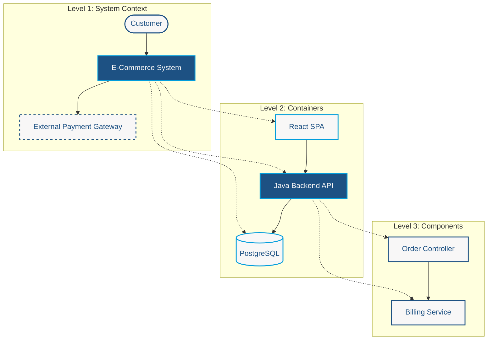

```mermaid
graph TD
    subgraph L1 [Level 1: System Context]
        User([Customer]) --> Sys[E-Commerce System]
        Sys --> Ext[External Payment Gateway]
    end

    subgraph L2 [Level 2: Containers]
        Sys -.-> Web[React SPA]
        Sys -.-> API[Java Backend API]
        Sys -.-> DB[(PostgreSQL)]
        Web --> API
        API --> DB
    end

    subgraph L3 [Level 3: Components]
        API -.-> C1[Order Controller]
        API -.-> C2[Billing Service]
        C1 --> C2
    end

    style User fill:#F8F7F7,stroke:#1D5183,stroke-width:2px,color:#1D5183
    style Sys fill:#1D5183,stroke:#019DDC,stroke-width:2px,color:#F8F7F7
    style Ext fill:#F8F7F7,stroke:#1D5183,stroke-width:2px,stroke-dasharray: 5 5,color:#1D5183
    style Web fill:#F8F7F7,stroke:#019DDC,stroke-width:2px,color:#1D5183
    style API fill:#1D5183,stroke:#019DDC,stroke-width:2px,color:#F8F7F7
    style DB fill:#F8F7F7,stroke:#019DDC,stroke-width:2px,color:#1D5183
    style C1 fill:#F8F7F7,stroke:#1D5183,stroke-width:2px,color:#1D5183
    style C2 fill:#F8F7F7,stroke:#1D5183,stroke-width:2px,color:#1D5183
```