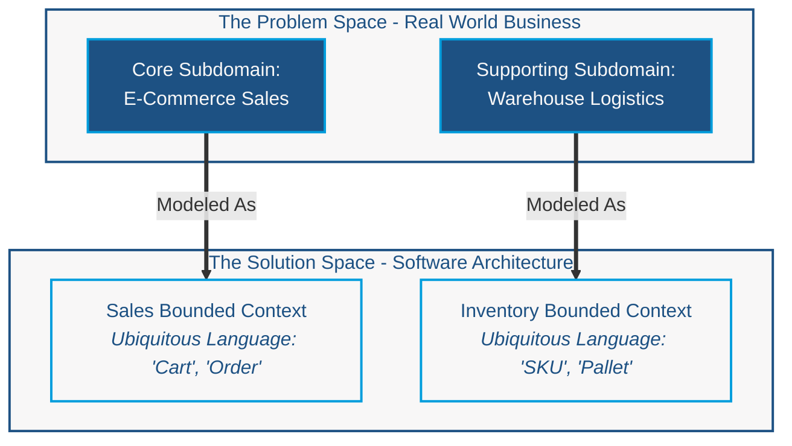

```mermaid
graph TD
    subgraph ProblemSpace [The Problem Space - Real World Business]
        S1[Core Subdomain:<br>E-Commerce Sales]
        S2[Supporting Subdomain:<br>Warehouse Logistics]
    end

    subgraph SolutionSpace [The Solution Space - Software Architecture]
        BC1[Sales Bounded Context<br><i>Ubiquitous Language: 'Cart', 'Order'</i>]
        BC2[Inventory Bounded Context<br><i>Ubiquitous Language: 'SKU', 'Pallet'</i>]
    end

    S1 == Modeled As ==> BC1
    S2 == Modeled As ==> BC2

    style ProblemSpace fill:#F8F7F7,stroke:#1D5183,stroke-width:2px,color:#1D5183
    style SolutionSpace fill:#F8F7F7,stroke:#1D5183,stroke-width:2px,color:#1D5183
    style S1 fill:#1D5183,stroke:#019DDC,stroke-width:2px,color:#F8F7F7
    style S2 fill:#1D5183,stroke:#019DDC,stroke-width:2px,color:#F8F7F7
    style BC1 fill:#F8F7F7,stroke:#019DDC,stroke-width:2px,color:#1D5183
    style BC2 fill:#F8F7F7,stroke:#019DDC,stroke-width:2px,color:#1D5183
```