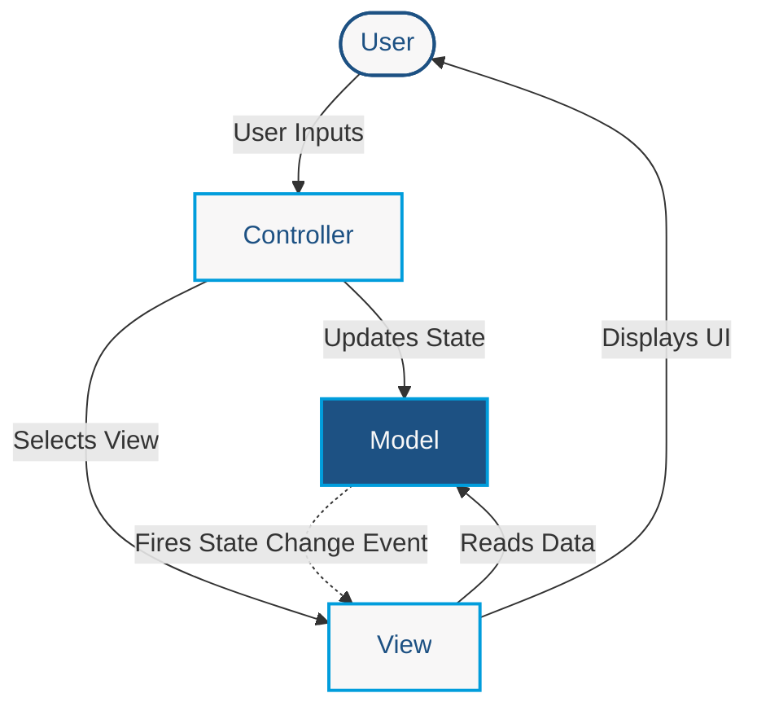

```mermaid
graph TD
    User([User]) -->|User Inputs| C[Controller]
    
    C -->|Updates State| M[Model]
    C -->|Selects View| V[View]
    
    M -.->|Fires State Change Event| V
    V -->|Reads Data| M
    
    V -->|Displays UI| User

    style User fill:#F8F7F7,stroke:#1D5183,stroke-width:2px,color:#1D5183
    style C fill:#F8F7F7,stroke:#019DDC,stroke-width:2px,color:#1D5183
    style M fill:#1D5183,stroke:#019DDC,stroke-width:2px,color:#F8F7F7
    style V fill:#F8F7F7,stroke:#019DDC,stroke-width:2px,color:#1D5183
```