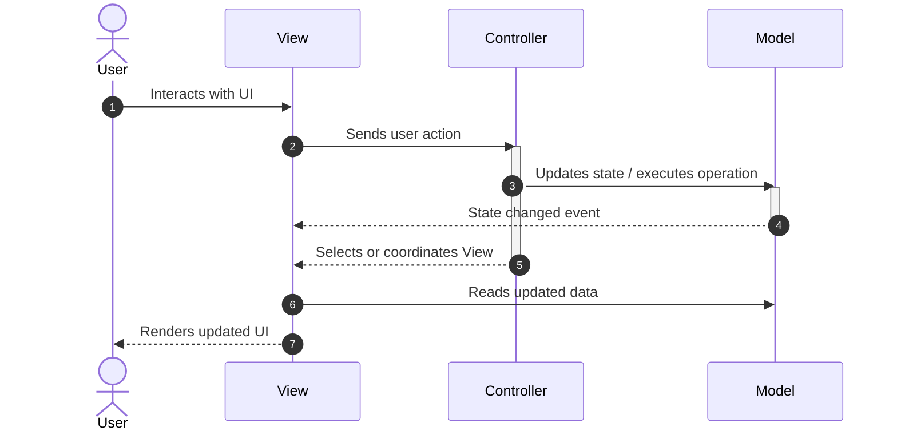

```mermaid
sequenceDiagram
    autonumber

    actor User
    participant V as View
    participant C as Controller
    participant M as Model

    User->>V: Interacts with UI
    V->>C: Sends user action
    activate C

    C->>M: Updates state / executes operation
    activate M
    M-->>V: State changed event
    deactivate M

    C-->>V: Selects or coordinates View
    deactivate C

    V->>M: Reads updated data
    V-->>User: Renders updated UI
```