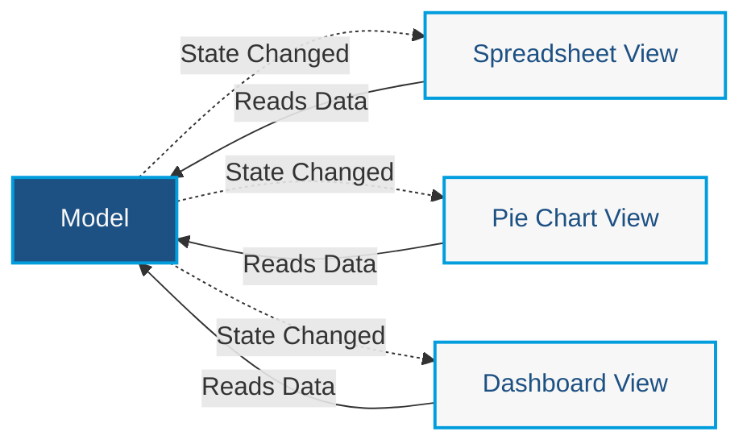

```mermaid
graph LR
    M[Model]

    V1[Spreadsheet View]
    V2[Pie Chart View]
    V3[Dashboard View]

    M -.->|State Changed| V1
    M -.->|State Changed| V2
    M -.->|State Changed| V3

    V1 -->|Reads Data| M
    V2 -->|Reads Data| M
    V3 -->|Reads Data| M

    style M fill:#1D5183,stroke:#019DDC,stroke-width:2px,color:#F8F7F7
    style V1 fill:#F8F7F7,stroke:#019DDC,stroke-width:2px,color:#1D5183
    style V2 fill:#F8F7F7,stroke:#019DDC,stroke-width:2px,color:#1D5183
    style V3 fill:#F8F7F7,stroke:#019DDC,stroke-width:2px,color:#1D5183
```