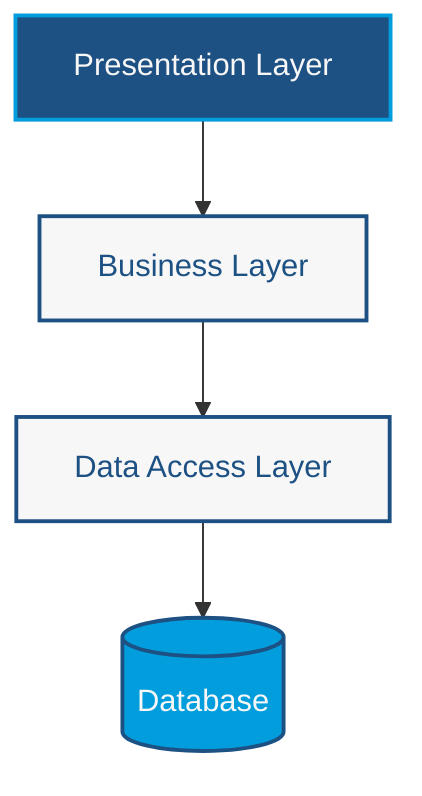

```mermaid
flowchart TD
    A[Presentation Layer]
    B[Business Layer]
    C[Data Access Layer]
    D[(Database)]

    A --> B
    B --> C
    C --> D

    style A fill:#1D5183,stroke:#019DDC,stroke-width:2px,color:#F8F7F7
    style B fill:#F8F7F7,stroke:#1D5183,stroke-width:2px,color:#1D5183
    style C fill:#F8F7F7,stroke:#1D5183,stroke-width:2px,color:#1D5183
    style D fill:#019DDC,stroke:#1D5183,stroke-width:2px,color:#F8F7F7
```