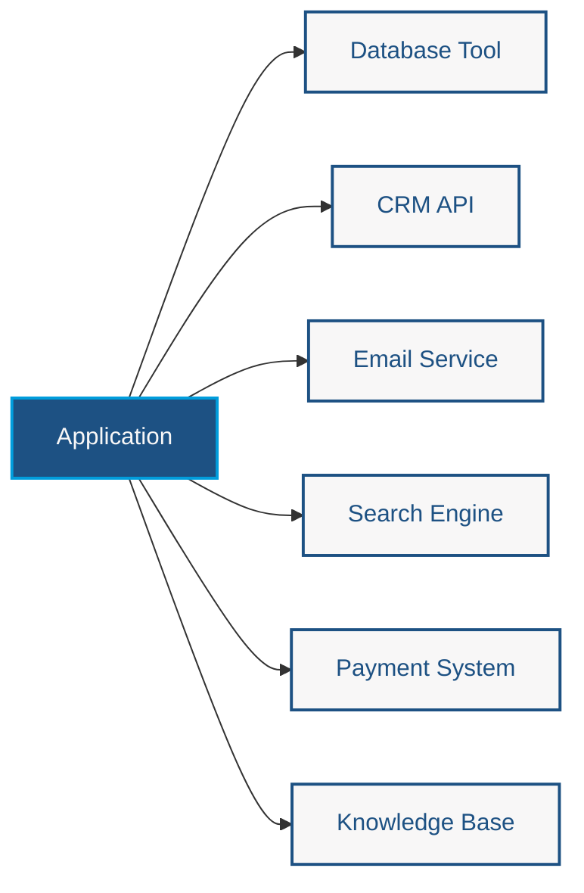

```mermaid
flowchart LR
    A[Application] --> B[Database Tool]
    A --> C[CRM API]
    A --> D[Email Service]
    A --> E[Search Engine]
    A --> F[Payment System]
    A --> G[Knowledge Base]

    style A fill:#1D5183,stroke:#019DDC,stroke-width:2px,color:#F8F7F7
    style B fill:#F8F7F7,stroke:#1D5183,stroke-width:2px,color:#1D5183
    style C fill:#F8F7F7,stroke:#1D5183,stroke-width:2px,color:#1D5183
    style D fill:#F8F7F7,stroke:#1D5183,stroke-width:2px,color:#1D5183
    style E fill:#F8F7F7,stroke:#1D5183,stroke-width:2px,color:#1D5183
    style F fill:#F8F7F7,stroke:#1D5183,stroke-width:2px,color:#1D5183
    style G fill:#F8F7F7,stroke:#1D5183,stroke-width:2px,color:#1D5183
```