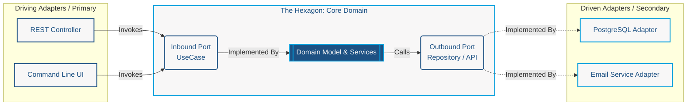

```mermaid
graph LR
    subgraph Driving Adapters [Driving Adapters / Primary]
        REST[REST Controller]
        CLI[Command Line UI]
    end

    subgraph Hexagon [The Hexagon: Core Domain]
        InPort(Inbound Port<br>UseCase)
        Core[[Domain Model & Services]]
        OutPort(Outbound Port<br>Repository / API)
        
        InPort -->|Implemented By| Core
        Core -->|Calls| OutPort
    end

    subgraph Driven Adapters [Driven Adapters / Secondary]
        SQL[PostgreSQL Adapter]
        SMTP[Email Service Adapter]
    end

    REST -->|Invokes| InPort
    CLI -->|Invokes| InPort
    
    OutPort -.->|Implemented By| SQL
    OutPort -.->|Implemented By| SMTP

    style REST fill:#F8F7F7,stroke:#1D5183,stroke-width:2px,color:#1D5183
    style CLI fill:#F8F7F7,stroke:#1D5183,stroke-width:2px,color:#1D5183
    style Hexagon fill:#F8F7F7,stroke:#019DDC,stroke-width:2px,color:#1D5183
    style InPort fill:#F8F7F7,stroke:#1D5183,stroke-width:2px,color:#1D5183
    style Core fill:#1D5183,stroke:#019DDC,stroke-width:2px,color:#F8F7F7
    style OutPort fill:#F8F7F7,stroke:#1D5183,stroke-width:2px,color:#1D5183
    style SQL fill:#F8F7F7,stroke:#019DDC,stroke-width:2px,color:#1D5183
    style SMTP fill:#F8F7F7,stroke:#019DDC,stroke-width:2px,color:#1D5183
```