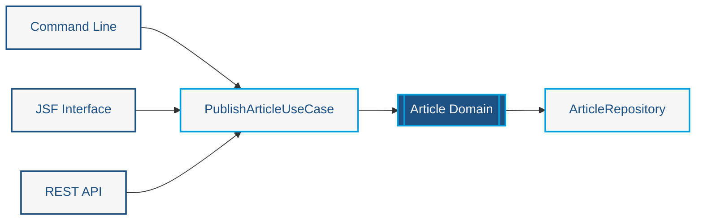

```mermaid
graph LR

CLI[Command Line]
JSF[JSF Interface]
REST[REST API]

UseCase[PublishArticleUseCase]

Domain[[Article Domain]]

Repository[ArticleRepository]

CLI --> UseCase
JSF --> UseCase
REST --> UseCase

UseCase --> Domain
Domain --> Repository

style CLI fill:#F8F7F7,stroke:#1D5183,stroke-width:2px,color:#1D5183
style JSF fill:#F8F7F7,stroke:#1D5183,stroke-width:2px,color:#1D5183
style REST fill:#F8F7F7,stroke:#1D5183,stroke-width:2px,color:#1D5183
style UseCase fill:#F8F7F7,stroke:#019DDC,stroke-width:2px,color:#1D5183
style Domain fill:#1D5183,stroke:#019DDC,stroke-width:2px,color:#F8F7F7
style Repository fill:#F8F7F7,stroke:#019DDC,stroke-width:2px,color:#1D5183
```