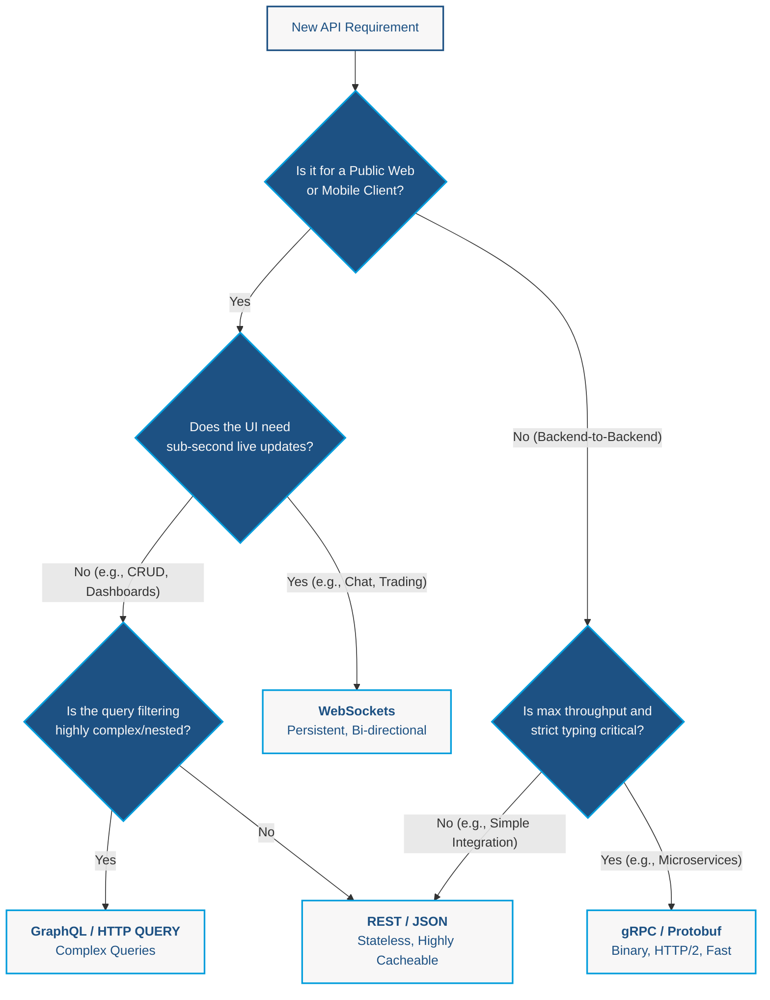

```mermaid
flowchart TD
    Start[New API Requirement] --> Q1{Is it for a Public Web<br>or Mobile Client?}
    
    Q1 -- Yes --> Q2{Does the UI need<br>sub-second live updates?}
    Q1 -- No (Backend-to-Backend) --> Q3{Is max throughput and<br>strict typing critical?}
    
    Q2 -- Yes (e.g., Chat, Trading) --> WS[<b>WebSockets</b><br>Persistent, Bi-directional]
    Q2 -- No (e.g., CRUD, Dashboards) --> Q4{Is the query filtering<br>highly complex/nested?}
    
    Q4 -- Yes --> GQL[<b>GraphQL / HTTP QUERY</b><br>Complex Queries]
    Q4 -- No --> REST[<b>REST / JSON</b><br>Stateless, Highly Cacheable]

    Q3 -- Yes (e.g., Microservices) --> GRPC[<b>gRPC / Protobuf</b><br>Binary, HTTP/2, Fast]
    Q3 -- No (e.g., Simple Integration) --> REST
    
    style Start fill:#F8F7F7,stroke:#1D5183,stroke-width:2px,color:#1D5183
    style Q1 fill:#1D5183,stroke:#019DDC,stroke-width:2px,color:#F8F7F7
    style Q2 fill:#1D5183,stroke:#019DDC,stroke-width:2px,color:#F8F7F7
    style Q3 fill:#1D5183,stroke:#019DDC,stroke-width:2px,color:#F8F7F7
    style Q4 fill:#1D5183,stroke:#019DDC,stroke-width:2px,color:#F8F7F7
    style WS fill:#F8F7F7,stroke:#019DDC,stroke-width:2px,color:#1D5183
    style REST fill:#F8F7F7,stroke:#019DDC,stroke-width:2px,color:#1D5183
    style GRPC fill:#F8F7F7,stroke:#019DDC,stroke-width:2px,color:#1D5183
    style GQL fill:#F8F7F7,stroke:#019DDC,stroke-width:2px,color:#1D5183
```