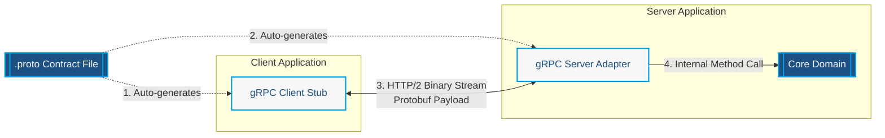

```mermaid
flowchart LR
    Proto[[.proto Contract File]]
    
    subgraph ClientSide [Client Application]
        Client[gRPC Client Stub]
    end
    
    subgraph ServerSide [Server Application]
        Server[gRPC Server Adapter]
        Domain[[Core Domain]]
    end
    
    Proto -.->|1. Auto-generates| Client
    Proto -.->|2. Auto-generates| Server
    
    Client <-->|3. HTTP/2 Binary Stream<br>Protobuf Payload| Server
    Server -->|4. Internal Method Call| Domain
    
    style Proto fill:#1D5183,stroke:#019DDC,stroke-width:2px,color:#F8F7F7
    style Client fill:#F8F7F7,stroke:#019DDC,stroke-width:2px,color:#1D5183
    style Server fill:#F8F7F7,stroke:#019DDC,stroke-width:2px,color:#1D5183
    style Domain fill:#1D5183,stroke:#019DDC,stroke-width:2px,color:#F8F7F7
```