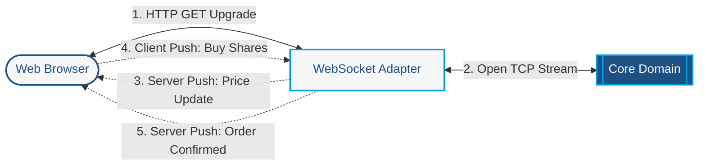

```mermaid
flowchart LR
    Client([Web Browser]) <-->|1. HTTP GET Upgrade| Adapter[WebSocket Adapter]
    Adapter <-->|2. Open TCP Stream| Domain[[Core Domain]]
    
    Adapter -.->|3. Server Push: Price Update| Client
    Client -.->|4. Client Push: Buy Shares| Adapter
    Adapter -.->|5. Server Push: Order Confirmed| Client

    style Client fill:#F8F7F7,stroke:#1D5183,stroke-width:2px,color:#1D5183
    style Adapter fill:#F8F7F7,stroke:#019DDC,stroke-width:2px,color:#1D5183
    style Domain fill:#1D5183,stroke:#019DDC,stroke-width:2px,color:#F8F7F7
```