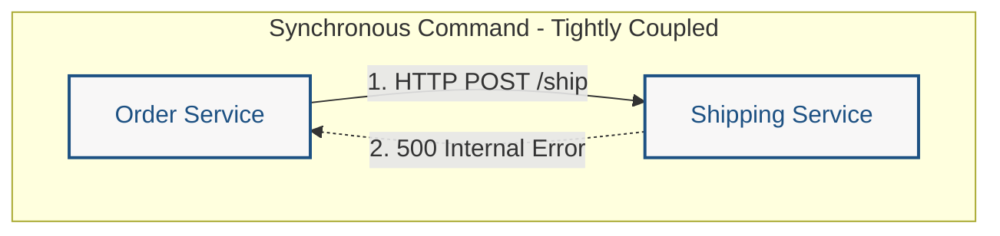

```mermaid
flowchart TD
    subgraph Sync [Synchronous Command - Tightly Coupled]
        A1[Order Service] -->|1. HTTP POST /ship| B1[Shipping Service]
        B1 -.->|2. 500 Internal Error| A1
    end


    style A1 fill:#F8F7F7,stroke:#1D5183,stroke-width:2px,color:#1D5183
    style B1 fill:#F8F7F7,stroke:#1D5183,stroke-width:2px,color:#1D5183
```