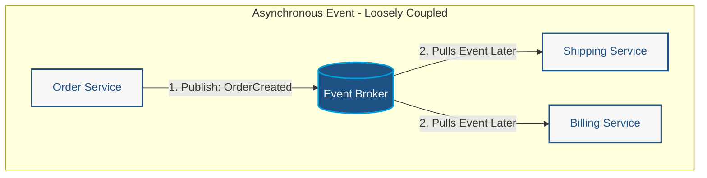

```mermaid
flowchart TD

    subgraph Async [Asynchronous Event - Loosely Coupled]
        A2[Order Service] -->|1. Publish: OrderCreated| Broker[(Event Broker)]
        Broker -->|2. Pulls Event Later| B2[Shipping Service]
        Broker -->|2. Pulls Event Later| C2[Billing Service]
    end

    style A2 fill:#F8F7F7,stroke:#1D5183,stroke-width:2px,color:#1D5183
    style B2 fill:#F8F7F7,stroke:#1D5183,stroke-width:2px,color:#1D5183
    style C2 fill:#F8F7F7,stroke:#1D5183,stroke-width:2px,color:#1D5183
    style Broker fill:#1D5183,stroke:#019DDC,stroke-width:2px,color:#F8F7F7
```