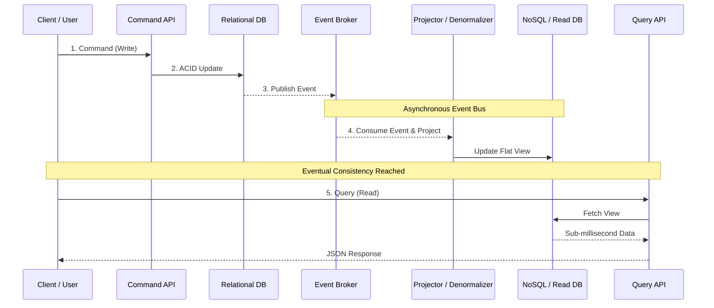

```mermaid
sequenceDiagram
    participant User as Client / User
    participant CmdAPI as Command API
    participant WriteDB as Relational DB
    participant Broker as Event Broker
    participant Projector as Projector / Denormalizer
    participant ReadDB as NoSQL / Read DB
    participant QryAPI as Query API

    User->>CmdAPI: 1. Command (Write)
    CmdAPI->>WriteDB: 2. ACID Update
    WriteDB-->>Broker: 3. Publish Event

    Note over Broker, ReadDB: Asynchronous Event Bus
    Broker-->>Projector: 4. Consume Event & Project
    Projector->>ReadDB: Update Flat View

    Note over User, QryAPI: Eventual Consistency Reached
    User->>QryAPI: 5. Query (Read)
    QryAPI->>ReadDB: Fetch View
    ReadDB-->>QryAPI: Sub-millisecond Data
    QryAPI-->>User: JSON Response

```