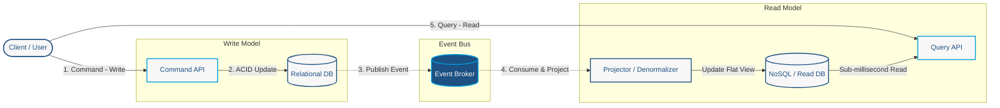

```mermaid
flowchart LR
    User([Client / User]) -->|1. Command - Write| CmdAPI[Command API]
    User -->|5. Query - Read| QryAPI[Query API]

    subgraph Command Stack [Write Model]
        CmdAPI -->|2. ACID Update| WriteDB[(Relational DB)]
    end

    subgraph Event Bus
        WriteDB -.->|3. Publish Event| Broker[(Event Broker)]
    end

    subgraph Query Stack [Read Model]
        Broker -.->|4. Consume & Project| Projector[Projector / Denormalizer]
        Projector -->|Update Flat View| ReadDB[(NoSQL / Read DB)]
        ReadDB -->|Sub-millisecond Read| QryAPI
    end

    style User fill:#F8F7F7,stroke:#1D5183,stroke-width:2px,color:#1D5183
    style CmdAPI fill:#F8F7F7,stroke:#019DDC,stroke-width:2px,color:#1D5183
    style QryAPI fill:#F8F7F7,stroke:#019DDC,stroke-width:2px,color:#1D5183
    style WriteDB fill:#F8F7F7,stroke:#1D5183,stroke-width:2px,color:#1D5183
    style ReadDB fill:#F8F7F7,stroke:#1D5183,stroke-width:2px,color:#1D5183
    style Broker fill:#1D5183,stroke:#019DDC,stroke-width:2px,color:#F8F7F7
    style Projector fill:#F8F7F7,stroke:#1D5183,stroke-width:2px,color:#1D5183
```