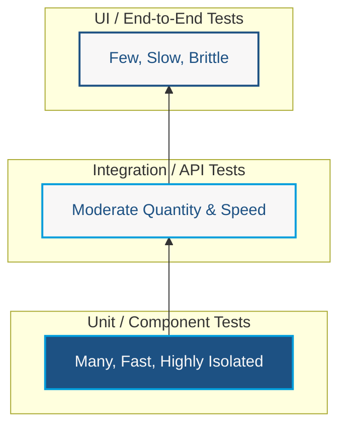

```mermaid
flowchart BT
    subgraph E2E [UI / End-to-End Tests]
        E[Few, Slow, Brittle]
    end
    subgraph Integration [Integration / API Tests]
        I[Moderate Quantity & Speed]
    end
    subgraph Unit [Unit / Component Tests]
        U[Many, Fast, Highly Isolated]
    end

    U --> I --> E

    style E fill:#F8F7F7,stroke:#1D5183,stroke-width:2px,color:#1D5183
    style I fill:#F8F7F7,stroke:#019DDC,stroke-width:2px,color:#1D5183
    style U fill:#1D5183,stroke:#019DDC,stroke-width:2px,color:#F8F7F7
```