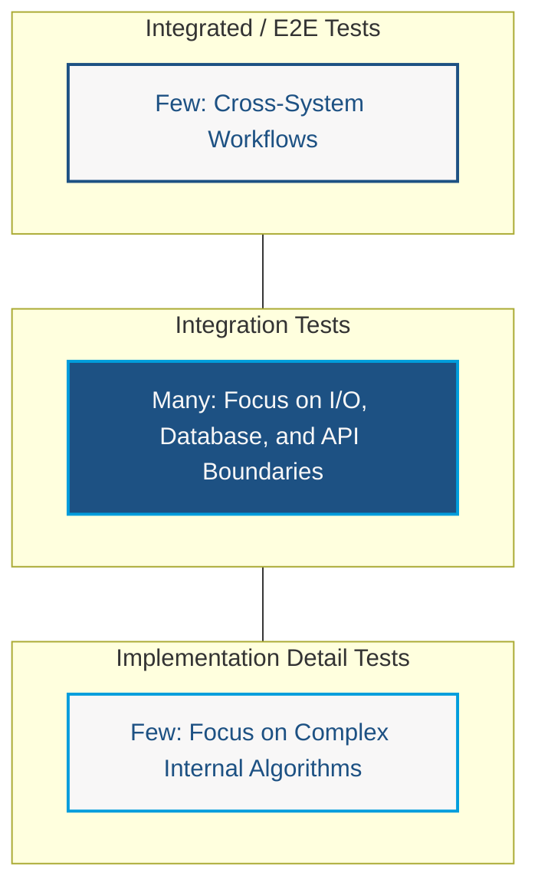

```mermaid
flowchart TD
    subgraph Integrated [Integrated / E2E Tests]
        E[Few: Cross-System Workflows]
    end
    subgraph Integration [Integration Tests]
        I[Many: Focus on I/O, Database, and API Boundaries]
    end
    subgraph Implementation [Implementation Detail Tests]
        U[Few: Focus on Complex Internal Algorithms]
    end

    Integrated --- Integration --- Implementation

    style E fill:#F8F7F7,stroke:#1D5183,stroke-width:2px,color:#1D5183
    style I fill:#1D5183,stroke:#019DDC,stroke-width:2px,color:#F8F7F7
    style U fill:#F8F7F7,stroke:#019DDC,stroke-width:2px,color:#1D5183
```