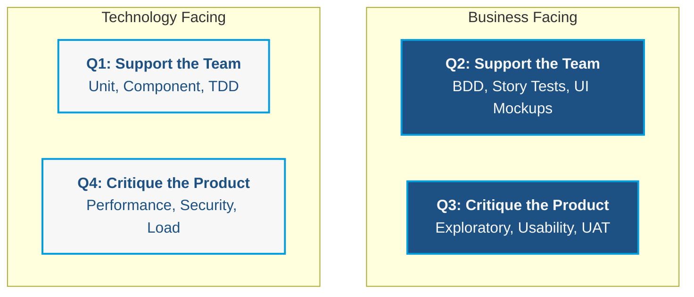

```mermaid
flowchart TD
    subgraph Business [Business Facing]
        Q2[<b>Q2: Support the Team</b><br>BDD, Story Tests, UI Mockups]
        Q3[<b>Q3: Critique the Product</b><br>Exploratory, Usability, UAT]
    end

    subgraph Technology [Technology Facing]
        Q1[<b>Q1: Support the Team</b><br>Unit, Component, TDD]
        Q4[<b>Q4: Critique the Product</b><br>Performance, Security, Load]
    end

    style Q1 fill:#F8F7F7,stroke:#019DDC,stroke-width:2px,color:#1D5183
    style Q2 fill:#1D5183,stroke:#019DDC,stroke-width:2px,color:#F8F7F7
    style Q3 fill:#1D5183,stroke:#019DDC,stroke-width:2px,color:#F8F7F7
    style Q4 fill:#F8F7F7,stroke:#019DDC,stroke-width:2px,color:#1D5183
```