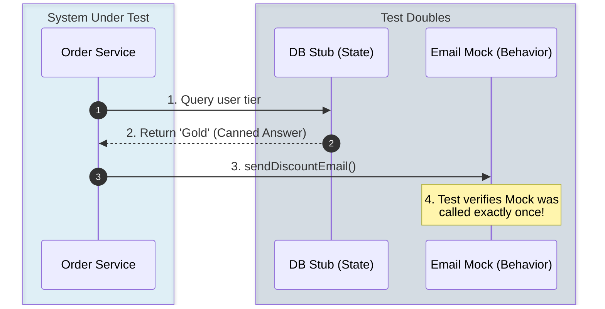

```mermaid
sequenceDiagram
    autonumber

    box rgba(1,157,220,0.1) System Under Test
        participant SUT as Order Service
    end

    box rgba(29,81,131,0.15) Test Doubles
        participant Stub as DB Stub (State)
        participant Mock as Email Mock (Behavior)
    end

    SUT->>Stub: 1. Query user tier
    Stub-->>SUT: 2. Return 'Gold' (Canned Answer)
    SUT->>Mock: 3. sendDiscountEmail()
    
    Note over Mock: 4. Test verifies Mock was<br/>called exactly once!
```