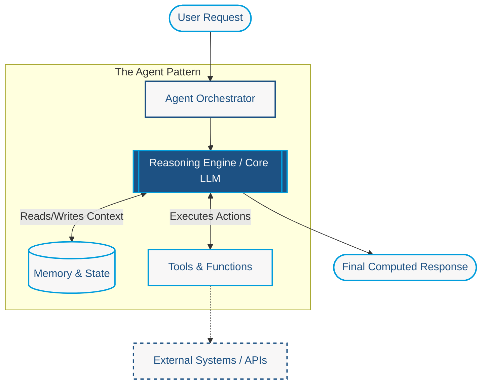

```mermaid
graph TD
    User([User Request]) --> AgentCore[Agent Orchestrator]
    
    subgraph The Agent Pattern
        AgentCore --> Reasoning[[Reasoning Engine / Core LLM]]
        Reasoning <-->|Reads/Writes Context| Memory[(Memory & State)]
        Reasoning <-->|Executes Actions| Tools[Tools & Functions]
    end
    
    Tools -.-> External[External Systems / APIs]
    Reasoning --> Output([Final Computed Response])
    
    style User fill:#F8F7F7,stroke:#019DDC,stroke-width:2px,color:#1D5183
    style AgentCore fill:#F8F7F7,stroke:#1D5183,stroke-width:2px,color:#1D5183
    style Reasoning fill:#1D5183,stroke:#019DDC,stroke-width:2px,color:#F8F7F7
    style Memory fill:#F8F7F7,stroke:#019DDC,stroke-width:2px,color:#1D5183
    style Tools fill:#F8F7F7,stroke:#019DDC,stroke-width:2px,color:#1D5183
    style External fill:#F8F7F7,stroke:#1D5183,stroke-width:2px,stroke-dasharray: 5 5,color:#1D5183
    style Output fill:#F8F7F7,stroke:#019DDC,stroke-width:2px,color:#1D5183
```