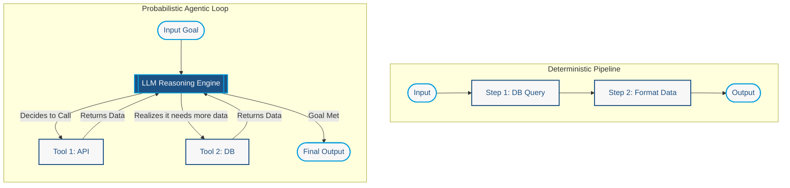

```mermaid
graph TD
    subgraph Traditional Pipeline [Deterministic Pipeline]
        direction LR
        P_In([Input]) --> P_Step1[Step 1: DB Query]
        P_Step1 --> P_Step2[Step 2: Format Data]
        P_Step2 --> P_Out([Output])
    end

    subgraph Agentic System [Probabilistic Agentic Loop]
        direction TB
        A_In([Input Goal]) --> Brain[[LLM Reasoning Engine]]
        Brain -->|Decides to Call| Tool1[Tool 1: API]
        Tool1 -->|Returns Data| Brain
        Brain -->|Realizes it needs more data| Tool2[Tool 2: DB]
        Tool2 -->|Returns Data| Brain
        Brain -->|Goal Met| A_Out([Final Output])
    end

    style P_In fill:#F8F7F7,stroke:#019DDC,stroke-width:2px,color:#1D5183
    style P_Step1 fill:#F8F7F7,stroke:#1D5183,stroke-width:2px,color:#1D5183
    style P_Step2 fill:#F8F7F7,stroke:#1D5183,stroke-width:2px,color:#1D5183
    style P_Out fill:#F8F7F7,stroke:#019DDC,stroke-width:2px,color:#1D5183

    style A_In fill:#F8F7F7,stroke:#019DDC,stroke-width:2px,color:#1D5183
    style Brain fill:#1D5183,stroke:#019DDC,stroke-width:2px,color:#F8F7F7
    style Tool1 fill:#F8F7F7,stroke:#1D5183,stroke-width:2px,color:#1D5183
    style Tool2 fill:#F8F7F7,stroke:#1D5183,stroke-width:2px,color:#1D5183
    style A_Out fill:#F8F7F7,stroke:#019DDC,stroke-width:2px,color:#1D5183

```