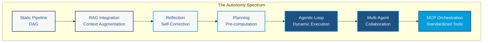

```mermaid
graph LR
subgraph The Autonomy Spectrum
direction LR
P[Static Pipeline<br/>DAG] --> R[RAG Integration<br/>Context Augmentation]
R --> Ref[Reflection<br/>Self-Correction]
Ref --> Plan[Planning<br/>Pre-computation]
Plan --> AL[Agentic Loop<br/>Dynamic Execution]
AL --> MAC[Multi-Agent<br/>Collaboration]
MAC --> MCP[MCP Orchestration<br/>Standardized Tools]
end

style P fill:#F8F7F7,stroke:#1D5183,stroke-width:2px,color:#1D5183
style R fill:#F8F7F7,stroke:#1D5183,stroke-width:2px,color:#1D5183
style Ref fill:#F8F7F7,stroke:#019DDC,stroke-width:2px,color:#1D5183
style Plan fill:#F8F7F7,stroke:#019DDC,stroke-width:2px,color:#1D5183
style AL fill:#1D5183,stroke:#019DDC,stroke-width:2px,color:#F8F7F7
style MAC fill:#1D5183,stroke:#019DDC,stroke-width:2px,color:#F8F7F7
style MCP fill:#019DDC,stroke:#1D5183,stroke-width:2px,color:#F8F7F7
```