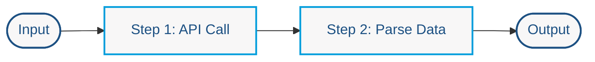

```mermaid
graph LR
In([Input]) --> S1[Step 1: API Call]
S1 --> S2[Step 2: Parse Data]
S2 --> Out([Output])

style In fill:#F8F7F7,stroke:#1D5183,stroke-width:2px,color:#1D5183
style S1 fill:#F8F7F7,stroke:#019DDC,stroke-width:2px,color:#1D5183
style S2 fill:#F8F7F7,stroke:#019DDC,stroke-width:2px,color:#1D5183
style Out fill:#F8F7F7,stroke:#1D5183,stroke-width:2px,color:#1D5183
```