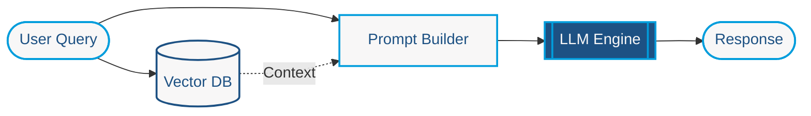

```mermaid
graph LR
    User([User Query])

    VectorDB[(Vector DB)]

    PromptBuilder[Prompt Builder]

    LLM[[LLM Engine]]

    Response([Response])

    User --> PromptBuilder
    User --> VectorDB

    VectorDB -.->|Context| PromptBuilder

    PromptBuilder --> LLM
    LLM --> Response

    style User fill:#F8F7F7,stroke:#019DDC,stroke-width:2px,color:#1D5183
    style VectorDB fill:#F8F7F7,stroke:#1D5183,stroke-width:2px,color:#1D5183
    style PromptBuilder fill:#F8F7F7,stroke:#019DDC,stroke-width:2px,color:#1D5183
    style LLM fill:#1D5183,stroke:#019DDC,stroke-width:2px,color:#F8F7F7
    style Response fill:#F8F7F7,stroke:#019DDC,stroke-width:2px,color:#1D5183
```