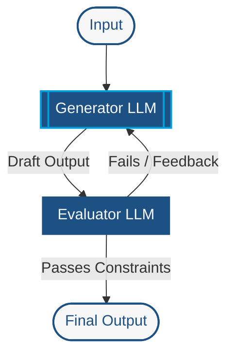

```mermaid
graph TD
In([Input]) --> Draft[[Generator LLM]]
Draft -->|Draft Output| Critic[[Evaluator LLM]]
Critic -->|Passes Constraints| Out([Final Output])
Critic -->|Fails / Feedback| Draft

style In fill:#F8F7F7,stroke:#1D5183,stroke-width:2px,color:#1D5183
style Draft fill:#1D5183,stroke:#019DDC,stroke-width:2px,color:#F8F7F7
style Critic fill:#1D5183,stroke:#1D5183,stroke-width:2px,color:#F8F7F7
style Out fill:#F8F7F7,stroke:#1D5183,stroke-width:2px,color:#1D5183
```