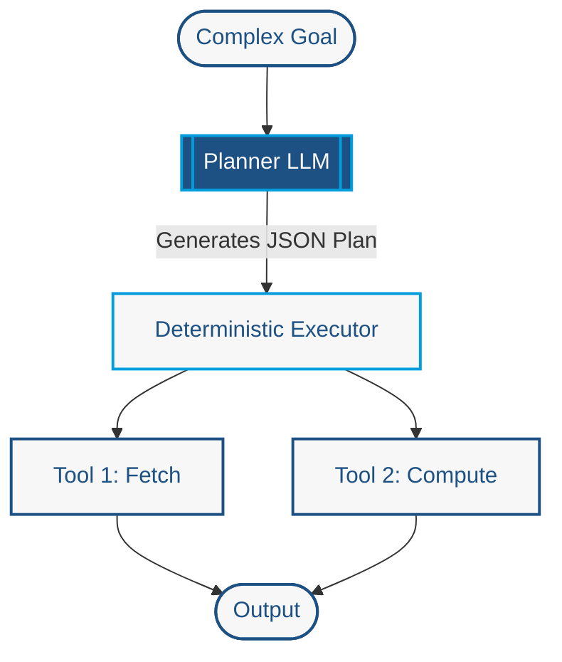

```mermaid
graph TD
In([Complex Goal]) --> Planner[[Planner LLM]]
Planner -->|Generates JSON Plan| Executor[Deterministic Executor]
Executor --> T1[Tool 1: Fetch]
Executor --> T2[Tool 2: Compute]
T1 --> Out([Output])
T2 --> Out

style In fill:#F8F7F7,stroke:#1D5183,stroke-width:2px,color:#1D5183
style Planner fill:#1D5183,stroke:#019DDC,stroke-width:2px,color:#F8F7F7
style Executor fill:#F8F7F7,stroke:#019DDC,stroke-width:2px,color:#1D5183
style T1 fill:#F8F7F7,stroke:#1D5183,stroke-width:2px,color:#1D5183
style T2 fill:#F8F7F7,stroke:#1D5183,stroke-width:2px,color:#1D5183
style Out fill:#F8F7F7,stroke:#1D5183,stroke-width:2px,color:#1D5183
```