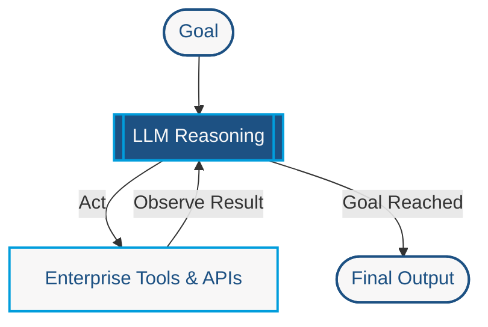

```mermaid
graph TD
In([Goal]) --> Agent[[LLM Reasoning]]
Agent -->|Act| Tools[Enterprise Tools & APIs]
Tools -->|Observe Result| Agent
Agent -->|Goal Reached| Out([Final Output])

style In fill:#F8F7F7,stroke:#1D5183,stroke-width:2px,color:#1D5183
style Agent fill:#1D5183,stroke:#019DDC,stroke-width:2px,color:#F8F7F7
style Tools fill:#F8F7F7,stroke:#019DDC,stroke-width:2px,color:#1D5183
style Out fill:#F8F7F7,stroke:#1D5183,stroke-width:2px,color:#1D5183
```