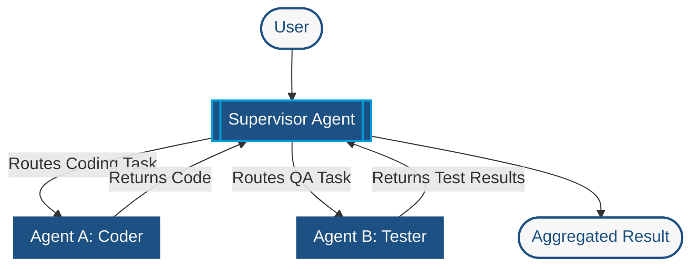

```mermaid
graph TD
    User([User]) --> Supervisor[[Supervisor Agent]]
    Supervisor -->|Routes Coding Task| A1[[Agent A: Coder]]
    A1 -->|Returns Code| Supervisor
    Supervisor -->|Routes QA Task| A2[[Agent B: Tester]]
    A2 -->|Returns Test Results| Supervisor
    Supervisor --> Out([Aggregated Result])
    
    style User fill:#F8F7F7,stroke:#1D5183,stroke-width:2px,color:#1D5183
    style Supervisor fill:#1D5183,stroke:#019DDC,stroke-width:2px,color:#F8F7F7
    style A1 fill:#1D5183,stroke:#1D5183,stroke-width:2px,color:#F8F7F7
    style A2 fill:#1D5183,stroke:#1D5183,stroke-width:2px,color:#F8F7F7
    style Out fill:#F8F7F7,stroke:#1D5183,stroke-width:2px,color:#1D5183
```