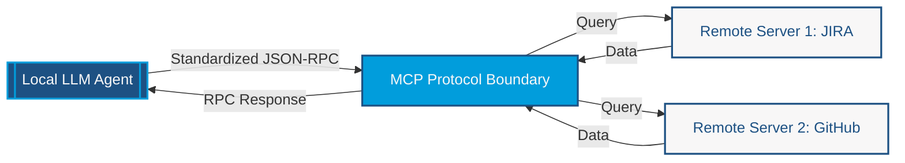

```mermaid
graph LR
    Agent[[Local LLM Agent]] -->|Standardized JSON-RPC| MCP[MCP Protocol Boundary]
    MCP -->|RPC Response| Agent
    MCP -->|Query| S1[Remote Server 1: JIRA]
    S1 -->|Data| MCP
    MCP -->|Query| S2[Remote Server 2: GitHub]
    S2 -->|Data| MCP
    
    style Agent fill:#1D5183,stroke:#019DDC,stroke-width:2px,color:#F8F7F7
    style MCP fill:#019DDC,stroke:#1D5183,stroke-width:2px,color:#F8F7F7
    style S1 fill:#F8F7F7,stroke:#1D5183,stroke-width:2px,color:#1D5183
    style S2 fill:#F8F7F7,stroke:#1D5183,stroke-width:2px,color:#1D5183
```