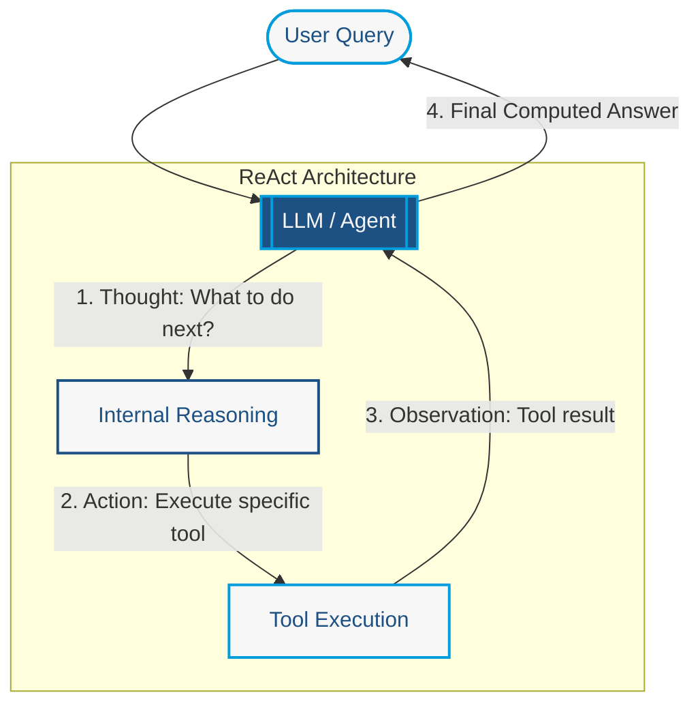

```mermaid
graph TD
User([User Query]) --> LLM[[LLM / Agent]]

subgraph ReAct Architecture
    LLM -->|1. Thought: What to do next?| Reason[Internal Reasoning]
    Reason -->|2. Action: Execute specific tool| Tool[Tool Execution]
    Tool -->|3. Observation: Tool result| LLM
end

LLM -->|4. Final Computed Answer| User

style User fill:#F8F7F7,stroke:#019DDC,stroke-width:2px,color:#1D5183
style LLM fill:#1D5183,stroke:#019DDC,stroke-width:2px,color:#F8F7F7
style Reason fill:#F8F7F7,stroke:#1D5183,stroke-width:2px,color:#1D5183
style Tool fill:#F8F7F7,stroke:#019DDC,stroke-width:2px,color:#1D5183
```