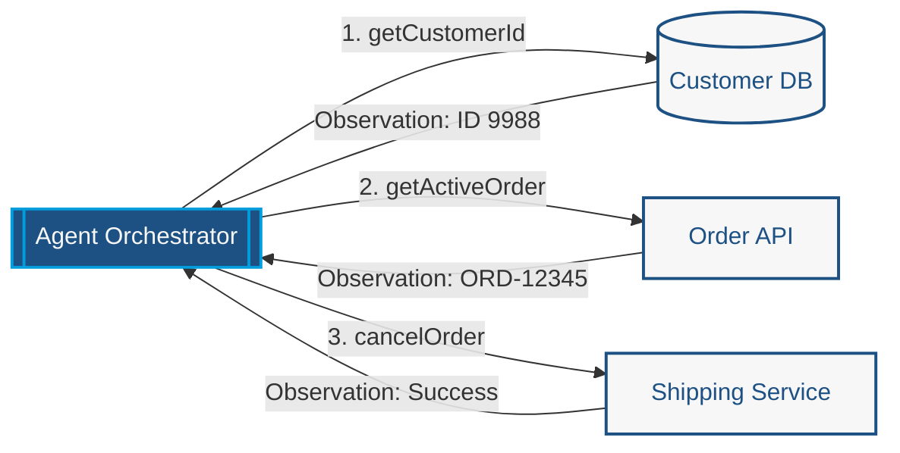

```mermaid
graph LR
LLM[[Agent Orchestrator]]

LLM -->|1. getCustomerId| DB[(Customer DB)]
DB -->|Observation: ID 9988| LLM

LLM -->|2. getActiveOrder| API[Order API]
API -->|Observation: ORD-12345| LLM

LLM -->|3. cancelOrder| Ship[Shipping Service]
Ship -->|Observation: Success| LLM

style LLM fill:#1D5183,stroke:#019DDC,stroke-width:2px,color:#F8F7F7
style DB fill:#F8F7F7,stroke:#1D5183,stroke-width:2px,color:#1D5183
style API fill:#F8F7F7,stroke:#1D5183,stroke-width:2px,color:#1D5183
style Ship fill:#F8F7F7,stroke:#1D5183,stroke-width:2px,color:#1D5183
```