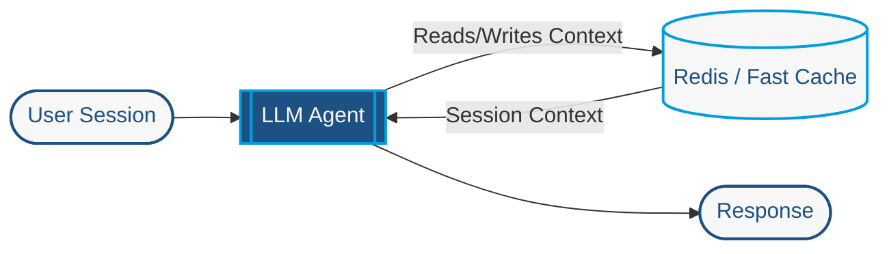

```mermaid
graph LR
User([User Session]) --> Agent[[LLM Agent]]
Agent -->|Reads/Writes Context| Cache[(Redis / Fast Cache)]
Cache -->|Session Context| Agent
Agent --> Out([Response])

style User fill:#F8F7F7,stroke:#1D5183,stroke-width:2px,color:#1D5183
style Agent fill:#1D5183,stroke:#019DDC,stroke-width:2px,color:#F8F7F7
style Cache fill:#F8F7F7,stroke:#019DDC,stroke-width:2px,color:#1D5183
style Out fill:#F8F7F7,stroke:#1D5183,stroke-width:2px,color:#1D5183
```