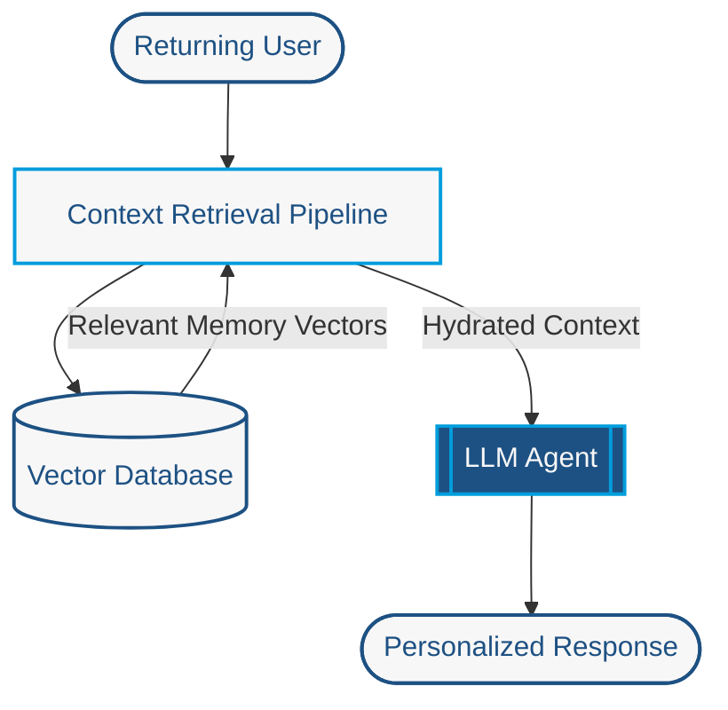

```mermaid
graph TD
User([Returning User]) --> RAG[Context Retrieval Pipeline]
RAG --> VDB[(Vector Database)]
VDB -->|Relevant Memory Vectors| RAG
RAG -->|Hydrated Context| Agent[[LLM Agent]]
Agent --> Out([Personalized Response])

style User fill:#F8F7F7,stroke:#1D5183,stroke-width:2px,color:#1D5183
style RAG fill:#F8F7F7,stroke:#019DDC,stroke-width:2px,color:#1D5183
style VDB fill:#F8F7F7,stroke:#1D5183,stroke-width:2px,color:#1D5183
style Agent fill:#1D5183,stroke:#019DDC,stroke-width:2px,color:#F8F7F7
style Out fill:#F8F7F7,stroke:#1D5183,stroke-width:2px,color:#1D5183
```