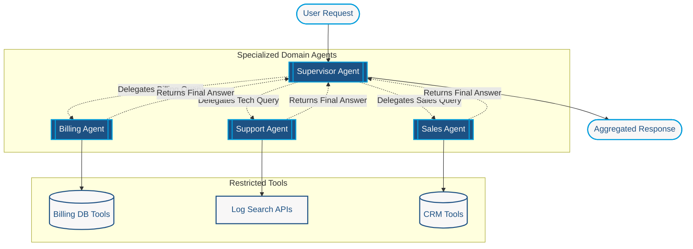

```mermaid
graph TD
    User([User Request]) --> Router[[Supervisor Agent]]
    
    subgraph Specialized Domain Agents
        Router -.->|Delegates Billing Query| AgentA[[Billing Agent]]
        Router -.->|Delegates Tech Query| AgentB[[Support Agent]]
        Router -.->|Delegates Sales Query| AgentC[[Sales Agent]]
    end
    
    subgraph Restricted Tools
        AgentA --> DB1[(Billing DB Tools)]
        AgentB --> API1[Log Search APIs]
        AgentC --> CRM[(CRM Tools)]
    end
    
    AgentA -.->|Returns Final Answer| Router
    AgentB -.->|Returns Final Answer| Router
    AgentC -.->|Returns Final Answer| Router
    
    Router --> Output([Aggregated Response])

    style User fill:#F8F7F7,stroke:#019DDC,stroke-width:2px,color:#1D5183
    style Router fill:#1D5183,stroke:#019DDC,stroke-width:2px,color:#F8F7F7
    style AgentA fill:#1D5183,stroke:#019DDC,stroke-width:2px,color:#F8F7F7
    style AgentB fill:#1D5183,stroke:#019DDC,stroke-width:2px,color:#F8F7F7
    style AgentC fill:#1D5183,stroke:#019DDC,stroke-width:2px,color:#F8F7F7
    style DB1 fill:#F8F7F7,stroke:#1D5183,stroke-width:2px,color:#1D5183
    style API1 fill:#F8F7F7,stroke:#1D5183,stroke-width:2px,color:#1D5183
    style CRM fill:#F8F7F7,stroke:#1D5183,stroke-width:2px,color:#1D5183
    style Output fill:#F8F7F7,stroke:#019DDC,stroke-width:2px,color:#1D5183
```