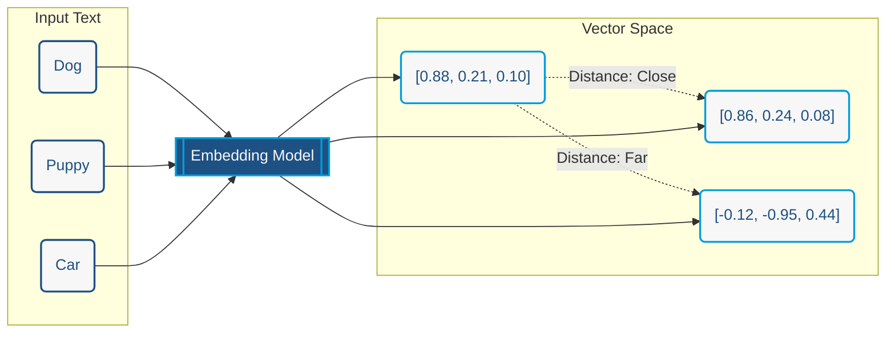

```mermaid
graph LR
    subgraph Input Text
        W1(Dog)
        W2(Puppy)
        W3(Car)
    end

    Model[[Embedding Model]]

    subgraph Vector Space
        V1("[0.88, 0.21, 0.10]")
        V2("[0.86, 0.24, 0.08]")
        V3("[-0.12, -0.95, 0.44]")
        
        V1 -.->|Distance: Close| V2
        V1 -.->|Distance: Far| V3
    end

    W1 --> Model
    W2 --> Model
    W3 --> Model

    Model --> V1
    Model --> V2
    Model --> V3

    style W1 fill:#F8F7F7,stroke:#1D5183,stroke-width:2px,color:#1D5183
    style W2 fill:#F8F7F7,stroke:#1D5183,stroke-width:2px,color:#1D5183
    style W3 fill:#F8F7F7,stroke:#1D5183,stroke-width:2px,color:#1D5183
    style Model fill:#1D5183,stroke:#019DDC,stroke-width:2px,color:#F8F7F7
    style V1 fill:#F8F7F7,stroke:#019DDC,stroke-width:2px,color:#1D5183
    style V2 fill:#F8F7F7,stroke:#019DDC,stroke-width:2px,color:#1D5183
    style V3 fill:#F8F7F7,stroke:#019DDC,stroke-width:2px,color:#1D5183
```