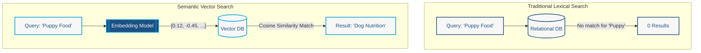

```mermaid
graph TD
    subgraph Traditional Lexical Search
        Q1[Query: 'Puppy Food'] --> DB1[(Relational DB)]
        DB1 -->|No match for 'Puppy'| Miss[0 Results]
    end

    subgraph Semantic Vector Search
        Q2[Query: 'Puppy Food'] --> Embed[[Embedding Model]]
        Embed -->|"[0.12, -0.45, ...]"| DB2[(Vector DB)]
        DB2 -->|Cosine Similarity Match| Hit[Result: 'Dog Nutrition']
    end

    style Q1 fill:#F8F7F7,stroke:#1D5183,stroke-width:2px,color:#1D5183
    style DB1 fill:#F8F7F7,stroke:#1D5183,stroke-width:2px,color:#1D5183
    style Miss fill:#F8F7F7,stroke:#1D5183,stroke-width:2px,color:#1D5183

    style Q2 fill:#F8F7F7,stroke:#019DDC,stroke-width:2px,color:#1D5183
    style Embed fill:#1D5183,stroke:#019DDC,stroke-width:2px,color:#F8F7F7
    style DB2 fill:#F8F7F7,stroke:#019DDC,stroke-width:2px,color:#1D5183
    style Hit fill:#F8F7F7,stroke:#019DDC,stroke-width:2px,color:#1D5183

```