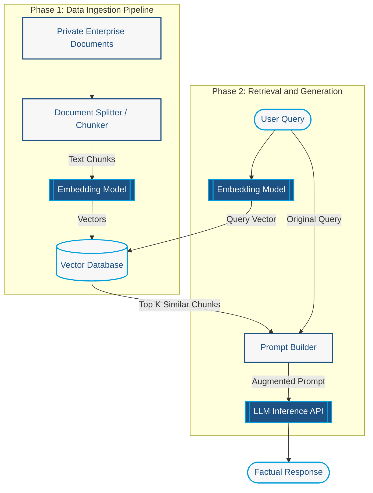

```mermaid
graph TD
    subgraph Phase1 [Phase 1: Data Ingestion Pipeline]
        Doc[Private Enterprise Documents] --> Chunk[Document Splitter / Chunker]
        Chunk -->|Text Chunks| Embed1[[Embedding Model]]
        Embed1 -->|Vectors| VDB[(Vector Database)]
    end

    subgraph Phase2 [Phase 2: Retrieval and Generation]
        User([User Query]) --> Embed2[[Embedding Model]]
        Embed2 -->|Query Vector| VDB
        VDB -->|Top K Similar Chunks| Prompt[Prompt Builder]
        User -->|Original Query| Prompt
        Prompt -->|Augmented Prompt| LLM[[LLM Inference API]]
    end

    LLM --> Out([Factual Response])

    style Doc fill:#F8F7F7,stroke:#1D5183,stroke-width:2px,color:#1D5183
    style Chunk fill:#F8F7F7,stroke:#1D5183,stroke-width:2px,color:#1D5183
    style Embed1 fill:#1D5183,stroke:#019DDC,stroke-width:2px,color:#F8F7F7
    style VDB fill:#F8F7F7,stroke:#019DDC,stroke-width:2px,color:#1D5183
    
    style User fill:#F8F7F7,stroke:#019DDC,stroke-width:2px,color:#1D5183
    style Embed2 fill:#1D5183,stroke:#019DDC,stroke-width:2px,color:#F8F7F7
    style Prompt fill:#F8F7F7,stroke:#1D5183,stroke-width:2px,color:#1D5183
    style LLM fill:#1D5183,stroke:#019DDC,stroke-width:2px,color:#F8F7F7
    style Out fill:#F8F7F7,stroke:#019DDC,stroke-width:2px,color:#1D5183
```