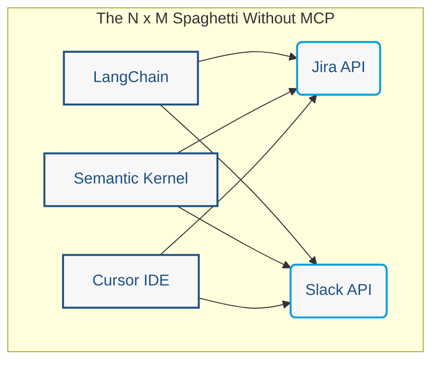

```mermaid
graph TD
    subgraph Spaghetti [The N x M Spaghetti Without MCP]
        LC[LangChain] --> J1(Jira API)
        LC --> S1(Slack API)
        SK[Semantic Kernel] --> J1
        SK --> S1
        IDE[Cursor IDE] --> J1
        IDE --> S1
    end

    style LC fill:#F8F7F7,stroke:#1D5183,stroke-width:2px,color:#1D5183
    style SK fill:#F8F7F7,stroke:#1D5183,stroke-width:2px,color:#1D5183
    style IDE fill:#F8F7F7,stroke:#1D5183,stroke-width:2px,color:#1D5183
    style J1 fill:#F8F7F7,stroke:#019DDC,stroke-width:2px,color:#1D5183
    style S1 fill:#F8F7F7,stroke:#019DDC,stroke-width:2px,color:#1D5183
```