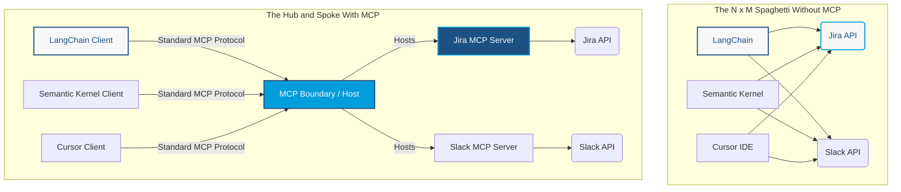

```mermaid
graph TD
    subgraph Spaghetti [The N x M Spaghetti Without MCP]
        LC[LangChain] --> J1(Jira API)
        LC --> S1(Slack API)
        SK[Semantic Kernel] --> J1
        SK --> S1
        IDE[Cursor IDE] --> J1
        IDE --> S1
    end

    subgraph HubSpoke [The Hub and Spoke With MCP]
        LC2[LangChain Client] -->|Standard MCP Protocol| MCP[MCP Boundary / Host]
        SK2[Semantic Kernel Client] -->|Standard MCP Protocol| MCP
        IDE2[Cursor Client] -->|Standard MCP Protocol| MCP
        
        MCP -->|Hosts| Srv1[Jira MCP Server]
        MCP -->|Hosts| Srv2[Slack MCP Server]
        
        Srv1 --> Native1(Jira API)
        Srv2 --> Native2(Slack API)
    end

    style LC fill:#F8F7F7,stroke:#1D5183,stroke-width:2px,color:#1D5183
    style J1 fill:#F8F7F7,stroke:#019DDC,stroke-width:2px,color:#1D5183
    style MCP fill:#019DDC,stroke:#1D5183,stroke-width:2px,color:#F8F7F7
    style Srv1 fill:#1D5183,stroke:#019DDC,stroke-width:2px,color:#F8F7F7
    style LC2 fill:#F8F7F7,stroke:#1D5183,stroke-width:2px,color:#1D5183
```