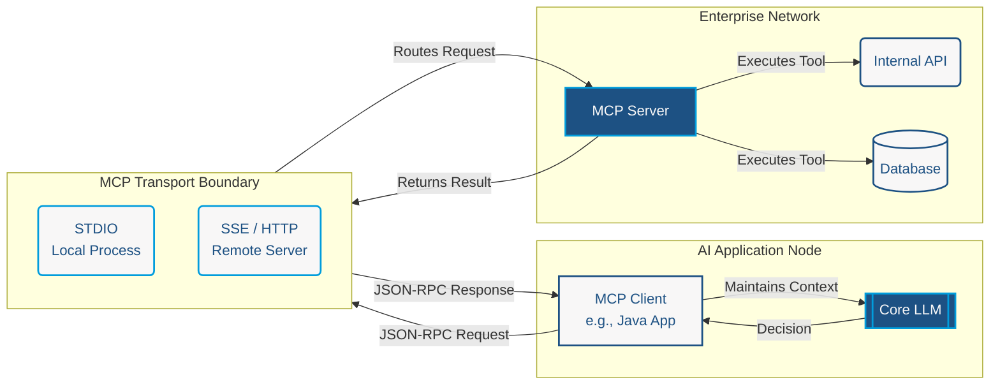

```mermaid
graph LR
    subgraph ClientNode [AI Application Node]
        Client[MCP Client<br>e.g., Java App] -->|Maintains Context| LLM[[Core LLM]]
        LLM -->|Decision| Client
    end

    subgraph TransportLayer [MCP Transport Boundary]
        direction TB
        T1(STDIO<br>Local Process)
        T2(SSE / HTTP<br>Remote Server)
    end

    subgraph ServerNode [Enterprise Network]
        Server[MCP Server] -->|Executes Tool| API(Internal API)
        Server -->|Executes Tool| DB[(Database)]
    end

    Client -->|JSON-RPC Request| TransportLayer
    TransportLayer -->|JSON-RPC Response| Client
    
    TransportLayer -->|Routes Request| Server
    Server -->|Returns Result| TransportLayer

    style Client fill:#F8F7F7,stroke:#1D5183,stroke-width:2px,color:#1D5183
    style LLM fill:#1D5183,stroke:#019DDC,stroke-width:2px,color:#F8F7F7
    style T1 fill:#F8F7F7,stroke:#019DDC,stroke-width:2px,color:#1D5183
    style T2 fill:#F8F7F7,stroke:#019DDC,stroke-width:2px,color:#1D5183
    style Server fill:#1D5183,stroke:#019DDC,stroke-width:2px,color:#F8F7F7
    style API fill:#F8F7F7,stroke:#1D5183,stroke-width:2px,color:#1D5183
    style DB fill:#F8F7F7,stroke:#1D5183,stroke-width:2px,color:#1D5183
```