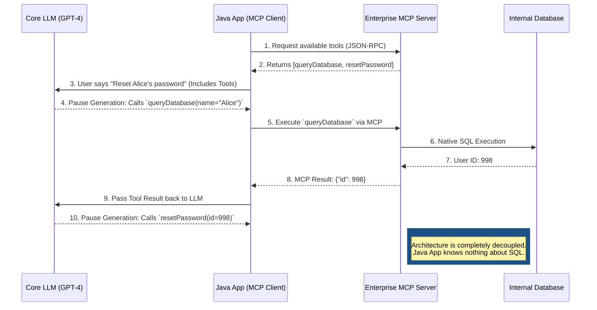

```mermaid
sequenceDiagram
    participant LLM as Core LLM (GPT-4)
    participant Client as Java App (MCP Client)
    participant Server as Enterprise MCP Server
    participant DB as Internal Database

    Client->>Server: 1. Request available tools (JSON-RPC)
    Server-->>Client: 2. Returns [queryDatabase, resetPassword]
    Client->>LLM: 3. User says "Reset Alice's password" (Includes Tools)
    LLM-->>Client: 4. Pause Generation: Calls `queryDatabase(name="Alice")`
    Client->>Server: 5. Execute `queryDatabase` via MCP
    Server->>DB: 6. Native SQL Execution
    DB-->>Server: 7. User ID: 998
    Server-->>Client: 8. MCP Result: {"id": 998}
    Client->>LLM: 9. Pass Tool Result back to LLM
    LLM-->>Client: 10. Pause Generation: Calls `resetPassword(id=998)`
    
    rect rgb(29, 81, 131)
        Note right of Server: Architecture is completely decoupled.<br>Java App knows nothing about SQL.
    end
```